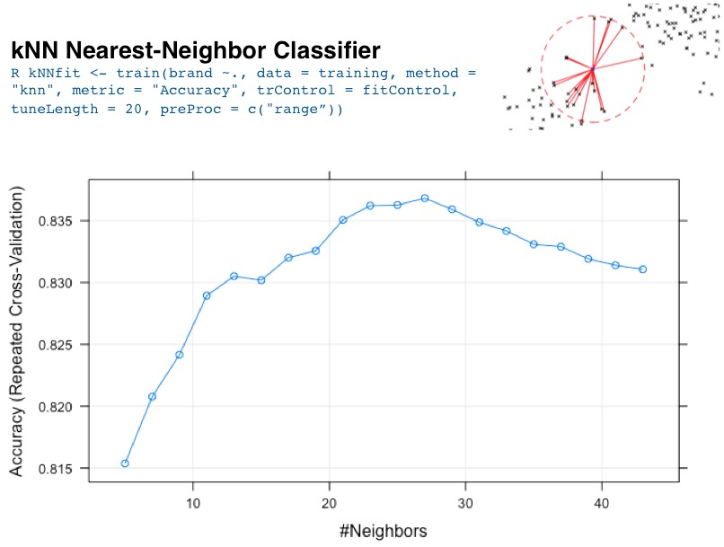

# R-Predicting-Brand-Preferences
A capstone project using R to explore demographic data and employ machine learning algorithms to predict customer brand preferences.

<H3>Goals</H3>

Predict customer preferences for a laptop brand based on other demographic data.

<OL>
<LI> Provided with a complete set of customer demographic data and laptop brand preferences.

<LI> Build, cross-validate, and refine classification models on the training dataset.

<LI> Test the refined classification models on hold-out data to further validate the models.

<LI> Apply the best model(s) to new demographic data and predict customer preference for a certain brand of laptop (Acer or Sony).

</OL>

R was used in this exercise and the packages caret, e1071, randomForest, C50, plyr, doMC, and ggplot2 were employed in the analysis.
 
 

<H3>Approach</H3>

Split the data (10,000 x 7 data.frame) into two sets: training (4,001 x 7 data.frame) and hold-out (5,999 x 7 data.frame).  The machine learning algorithms were optimized on the training data and the optimized models were evaluated against the training and hold-out data.  The models were also trained with 10-fold cross-validation to minimize the risk of overfitting the training dataset.

Four different classifier models (RandomForest, c5.0, kNN Nearest-Neighbors, and e1071 Support Vector with various kernels) were built, refined, and evaluated against the training dataset.  The models were optimized for the accuracy metric associated with the confusion matrix output of each model.  The metrics for each model were calculated using scripts I wrote to streamline the evaluation process and allow rapid identification of an optimal model.  Selection and employment of the optimal model could easily be automated using this approach.  

An example of the kNN Nearest-Neighbor model optimization is shown below:

</IMG>

<H3>Results</H3>

The RandomForest (RF) and c5.0 models provided the most accurate, precise, and sensitive classification results when evaluated against both the training and hold-out data (RF hold-out data: accuracy=0.92, precision=0.90).  Both models were then applied to new customer data to predict laptop brand preferences using customer demographic data.  RandomForest used all data fields for its classification (salary, age, education level, car, zip code, credit availability), whereas the c5.0 model relied on two data fields for its classification (salary, age).

The methods, results, and summary are in the PDF file.  The RDATA file for the complete analysis is also provided above.

Benjamin P. Fauber
